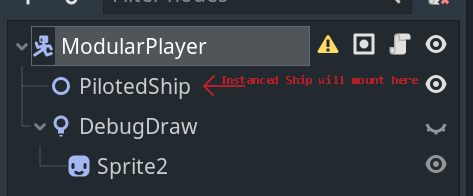
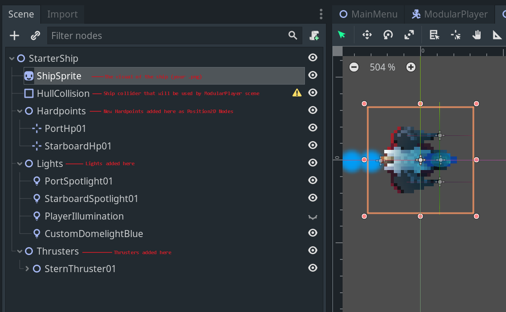

- [Kyle's DevJournal](#kyles-devjournal)
- [Godot Specifics (*Work in Progress/Active Design)](#godot-specifics-work-in-progressactive-design)
  - [World/Game Scenes](#worldgame-scenes)
    - [Home Base](#home-base)
    - [Asteroid Field Scenes (Mining and Combat!)](#asteroid-field-scenes-mining-and-combat)
    - [Making a test Asteroid Field Scene](#making-a-test-asteroid-field-scene)
  - [Player Scene](#player-scene)
    - [ModularPlayer Ship Controller](#modularplayer-ship-controller)
    - [Ship Scene Template](#ship-scene-template)
- [Notes on Ship Design](#notes-on-ship-design)
  - [Ship Flight Feel](#ship-flight-feel)
  - [Inventory](#inventory)
  - [Hardpoint and Equipment Management](#hardpoint-and-equipment-management)
  - [Modular Ship](#modular-ship)
    - [Character Sheet Example](#character-sheet-example)

Return to [README.md](README.md) 

# Kyle's DevJournal
I'll be using this document as a means to collect my ideas on the overall design and schema of V.A.M. Empire primarily as a means to help keep my thoughts organized, but also as an easy way to make the information accessible without spamming Discord or overfilling cards on Trello. A place to be freely verbose, dream, ramble, explore... So, if I say something below that never makes it in the game? That's to be expected!

# Godot Specifics (*Work in Progress/Active Design)

## World/Game Scenes

### Home Base
At current moment, the Home Base is simply a scene to hang some buttons on to instance our world scenes. I did pair it with a nice little ship take-off animation just to make it feel like a "base" though! If you have a new world scene you want other members of the project to test out, feel free to add a launcher from this scene.  As our test scenes grow, I'll likely change from using big buttons to something like a Drop Down list and we can start adding our .tscn files to a Dictionary to manage them all.

### Asteroid Field Scenes (Mining and Combat!)

As of right now, there is only 1 required object for a World scene. 
- [ReturnHomeBeacon.tscn](../../World/common_scenes/ReturnHomeBeacon.tscn)
  - This beacon object has a simple 10 second countdown timer activated by the player entering its collider, that will return the player to the "Home Base" level selection screen. Without it, the player will be maroooned in space!

As more things become parts of our base scene, they will be added here. 

### Making a test Asteroid Field Scene
* The scene [TemplateAsteroidZone](../../World/game_zones/TemplateAsteroidZone.tscn) will be kept up to date to reflect the "minimum" pieces required for a scene to function in game. Feel free to instance from this scene and make your own scenes and freely experiment!

## Player Scene
### ModularPlayer Ship Controller
- The player controller scene (ModularPlayer.tscn) will load ships at the PilotedShip Node2D.
- The KinematicBody2D node ModularPlayer starts with no Collision2D. The instanced Ship will have a CollisionShape2D named HullCollision which will be reparented to ModularPlayer at runtime.

Modular Player Ship Scene Example 

### Ship Scene Template
  
Each ship will have the following "Node2D" groupings for parts:
- Hardpoints
  - Collection of Position2D Nodes
  - Individual Hardpoints will be labeled "Bow" (front), "Stern" rear,  "Starboard" and "Port" and enumerated using 2 digits i.e. PortHp01, StarboardHp01. A designation/standard for pure-center will need to be decided.
- Lights
  - Collection of Light2D Nodes and any framing Occluder2Ds required
  - Inididual Lights will be labeled "Starboard" and "Port", designate a "type" and enumerated using 2 digits i.e. PortSpotlight01, StarboardSpotlight01
  - Some lights will be standard to all ships, i.e. "PlayerIllumination" will always be the basic ship lighting to set the 'base level' of lighting for the player.
  - Custom 1 off lights for a ship will start "Custom" and will work largely as static lights, but can have localized scripting in the ship scene.
- Thrusters (Very much WIP)
  - Collection of Thrusters which will be more complex Node objects, involving particle effects/lights and more.
  - Same conventions as followed in other collections, but *TBD* need to designate whether they are Stern thrusters, Bow braking thrusters, or Port/Starboard strafing thrusters. RCS/flight stabilization thrusters will likely come into the mix here as well.

 Example of the Starter Ship from the Demo in our new Modular Ship Form 

TBD: A "Template Scene" will be created that all ships can be created from with the basics needed to get a 2 Hardpoint, 2 Forward Light, 1 Thruster ship started. Then the designer can add more from there.

# Notes on Ship Design
## Ship Flight Feel

Starting simply, a good goal to have for the flight system of our player ship will be to make sure that the first ship "flys poorly", yet is still fun to fly from the very start.
If the first ship is too much of a chore to fly around, the player may never engage or feel like they want to engage with the game. Yet, when they get that first big module upgrade to tighten up the ships turning speed, or maybe its an RCS upgrade the lets the ship have finer grain control in difficult and narrow flight situations, they'll notice it and want to keep improving the ship going forward. But ultimately, it should feel good in the players hands early on, and only get better or more focused for particular taks from there.

## Inventory

I've been looking at other implementations of inventories in Godot, and have a sense for some approaches here now, but I'm quickly realizing that I want to get a grasp on how we'll approach Saving and Loading both the game state as well as the player state *first*, to make sure we make the right decisions on handling inventory without putting outselves into a tricky situation later.

That said, like a lot of things with Godot, our inventory can likely start out as a method of organizing game objects in node trees parented to the player's ship, with the "Item" class we create being a collection of the game assets required:
- Icon for the inventory UI
- Class specifics (Weapon Stats, Ship Module Stats for instance)
- A reference to the '.tscn' game scene for instantiating this object in 'game space', i.e. mounting a weapon to a ship hardpoint, or 'ejecting' a mineral back into space
- Capacity/Mass... Each ship should have a hauling capacity 

## Hardpoint and Equipment Management

Hardpoints and Ship Equipment slots will be another element of the larger inventory system, and will interact with the same items that go in the inventory. I.e. you will be able to drag a weapon from your inventory to the hardpoint slot on the ship. This may end up limited to only being something the player can do back at homebase with the assistance of the "Mechanic", but from a technical perspective we can allow it anywhere for debug purposes.

## Modular Ship

We do not yet have any "modular" ships in V.A.M. Empire, but designing a new ship in V.A.M. will likely break down into the following steps, so keep them in mind as we move forward if you want to jump right in and start designing! These are also only suggestions at a direction, we can tweak at this all we need to. The ultimate goal is just to make a smooth pipeline so taking something from a neat idea to a ship zipping around in space is as painless as possible.

1) Draw/Design the general look of the ship.
2) Determine where things like Hardpoints (Weapons/Mining Lasers/etc..) will go
3) Decide the class "Small, Medium, Large" of the hardpoints (so weapon's can be designed to fit based on these designations)
4) Design the ship in Godot as a single scene, using [Ship Scene Template](#ship-scene-template) naming conventions for things like Position2Ds that will designate where the hardpoints are on the ship.
5) Decide stock (pre-upgrade module) ship variables for things like flight variables, hull strength, shield strength etc..
6) Test the ship out with existing modules and parts
7) The inventory and equipment management screens in game should also be designed in a way, that the UI will automatically build a character sheet style layout for the player to drop on weapons and modules. Thinking Diablo/ARPG style character sheet for this. 

### Character Sheet Example
   

Imagine the # of weapon slots is slightly dynamic, and maybe even their position on the character sheet is tied back to their location on the Ship "in-game".

