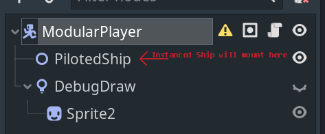

- [**V.A.M. Empire Game Info**](#vam-empire-game-info)
- [**Important Project Info for Contributors**](#important-project-info-for-contributors)
- [**V.A.M. Empire DevJournal**](#vam-empire-devjournal)
- [**Disclaimer**](#disclaimer)
- [**Project Standards and Conventions**](#project-standards-and-conventions)
  - [**Art Standards**](#art-standards)
    - [**Player Ship Conventions**](#player-ship-conventions)
    - [**Mounted Weapon/Mining Tool Conventions**](#mounted-weaponmining-tool-conventions)
    - [**Enemy Ship Conventions** [WIP]](#enemy-ship-conventions-wip)
    - [**Level Objects** [WIP]](#level-objects-wip)
  - [**Autoload Singletons**](#autoload-singletons)
    - [**Global.gd**](#globalgd)
    - [**PlayerVars.gd**](#playervarsgd)
    - [**UserSettings.gd**](#usersettingsgd)
- [**World/Game Scenes**](#worldgame-scenes)
  - [**Home Base**](#home-base)
  - [**Terminology for Game Zones**](#terminology-for-game-zones)
    - [**Zones**](#zones)
    - [**Areas**](#areas)
    - [**Encounters**](#encounters)
    - [**Points of Interest**](#points-of-interest)
    - [**Making a new Zone or Scene Element**](#making-a-new-zone-or-scene-element)
  - [**Player Scene**](#player-scene)
    - [**HealBot**](#healbot)
    - [**Player Menus**](#player-menus)
    - [**Inventory**](#inventory)
      - [**CharacterSheet**](#charactersheet)
      - [**PlayerDebugMenu**](#playerdebugmenu)
    - [**ModularPlayer Ship Controller**](#modularplayer-ship-controller)
- [**Ship Specifications**](#ship-specifications)
  - [**Ship Scene Template**](#ship-scene-template)
    - [**Packed Ship Scene**](#packed-ship-scene)
- [**Weapon Specifications**](#weapon-specifications)
  - [**Weapon Scene Template**](#weapon-scene-template)
    - [**Packed Weapons Scene**](#packed-weapons-scene)
- [**NPC AI**](#npc-ai)
  - [**Actors**](#actors)
    - [**AI**](#ai)
    - [**Steering**](#steering)
- [**UI**](#ui)
  - [**Player HUD**](#player-hud)
    - [**HUD.tscn**](#hudtscn)
    - [**MiniMap.tscn**](#minimaptscn)
      - [**Requirements for MiniMap Objects**](#requirements-for-minimap-objects)
      - [**Objects in group mini_map**](#objects-in-group-mini_map)
      - [**Objects in group mini_map + always_on_map**](#objects-in-group-mini_map--always_on_map)
  - [**Reusable UI Elements**](#reusable-ui-elements)
- [**Plugins**](#plugins)
  - [**V.A.M. Item Smith and the Inventory Database**](#vam-item-smith-and-the-inventory-database)
    - [**V.A.M. Item Smith Plugin Files**](#vam-item-smith-plugin-files)
      - [**Functions of VAM Item Smith**](#functions-of-vam-item-smith)
- [**Appendix A: Universal Godot Information**](#appendix-a-universal-godot-information)
  - [**Coming from Unity**](#coming-from-unity)
  - [**GDScript**](#gdscript)
  - [**The Node Tree**](#the-node-tree)
    - [**Node Tree Best Practices**](#node-tree-best-practices)
  - [**Global Singletons/Autoload Scripts**](#global-singletonsautoload-scripts)
  - [**Debugging and the Remote Scene Tree**](#debugging-and-the-remote-scene-tree)
  - [**Learning Resources**](#learning-resources)
    - [**HomeTeam Produced Content**](#hometeam-produced-content)
    - [**Written Documentation/Resources**](#written-documentationresources)
    - [**Useful and Concise Youtube/Video Resources**](#useful-and-concise-youtubevideo-resources)
- [Appendix X: Original Thoughts on Design by Kyle Black](#appendix-x-original-thoughts-on-design-by-kyle-black)
  - [Notes on Ship Design](#notes-on-ship-design)
    - [Ship Flight Feel](#ship-flight-feel)
    - [Inventory](#inventory-1)
    - [Hardpoint and Equipment Management](#hardpoint-and-equipment-management)
    - [Modular Ship](#modular-ship)
      - [Character Sheet Example](#character-sheet-example)

# **V.A.M. Empire Game Info**

V.A.M. Empire is a Hometeam GameDev Lighthouse Project running from April 4th, 2021 to July 28th, 2021. 
# **Important Project Info for Contributors**
[Trello](https://trello.com/b/XcQmS3nu) Use the Trello to find new tasks to jump onto (Add yourself to the card), start your own task, or just get an idea of what we're all focused on each week.

# **V.A.M. Empire DevJournal**
This doc is a means to collect the overall design and schema of V.A.M. Empire. An easy way to make the information accessible without spamming Discord or overfilling cards on Trello. A place to be freely verbose, dream, ramble, explore ideas in the design sections, but most importantly to accurately capture how our many little interconnected systems work... So, if things are out of date, try to bring them back into phase so that all members can quickly jump in and learn!

# **Disclaimer**
In many cases below you'll see references to "a good way to do something". Since Godot is new to HomeTeam many of us are learning as we go, so often times this means "the way it works right now, because we might not yet know **`The Best Way`**. As we find the best ways to create together in Godot, these pieces and parts will likely drastically change. Since this is also only the 2nd Godot project at Hometeam, a lot of this information can start to coalesce into resources for future HTGD Godot projects! As we identify these things we can put them in [**Appendix A: Universal Godot Information**](#appendix-a-universal-godot-information).

# **Project Standards and Conventions**
## **Art Standards**
- Game Screen is 960x540 pixels
- Color Palette (even for in game things like lighting is) AAP 64 by Adigun Polack
  - Available standard in Aseprite
- All pixel sizes (32x32, 64x64, etc..) are just denoting the bounding box "maximums"
  
<sub> AAP 64 Palette </sub>


### **Player Ship Conventions**
- Small Ships (Player: Frigate Class | VAM: Impaler Class)
  - Pixels: 32x32
  - Max Hardpoints: 3
  - Carrying Capacity Range: TBD
  - Hardpoint Sizes: S
- Medium Ships (Player: Destroyer Class | VAM: Stoker Class)
  - Pixels: 64x64
  - Max Hardpoints: TBD
  - Carrying Capacity Range: TBD
  - Hardpoint Sizes: S, M
- Large Ships (Player: Corvette Class | VAM: Kinski Class)
  - Pixels: 128x128
  - Max Hardpoints: TBD
  - Carrying Capacity Range: TBD
  - Hardpoint Sizes: M, L
- X-Large Ships (Player: Dreadnought Class | VAM: Nosferatu Class)
  - Pixels: 256x256
  - Max Hardpoints: TBD
  - Carrying Capacity Range: TBD
  - Hardpoint Sizes: L, XL

### **Mounted Weapon/Mining Tool Conventions**
As hardpoint mounted weapons get created, we will flesh out the standards here. These specs should work well for the ship sizes they are built to fit, to make them as modular as possible.
- Small Hardpoints
  - Pixels: TBD
- Medium Hardpoints
  - Pixels: TBD
- Large Hardpoints
  - Pixels: TBD
- X-Large Hardpoints
  - Pixels: TBD

### **Enemy Ship Conventions** [WIP]
At the current moment, for enemy ships in the same class sizes as player ships, we'll just match the art conventions in [Player Ship Conventions](#player-ship-conventions) . For Mini-Boss -> Final Boss sized enemies, we'll have to do some experimenting to see what works.

### **Level Objects** [WIP]

Most things outside of the Player ship and enemy ships and their interconnected components are free reign at the current moment. The tighter specs on the ships is primarily to make standardizing the Player/Ship controller easier in the long run and work with as many ships as possible. Asteroids and the other objects in space don't have to follow any strict standards for now. Let 'er rip! 

## **Autoload Singletons**

### **Global.gd**
A place to store common reusable functions that can be referenced from anywhere in the project i.e. `Global.halt_fire(true)` to disable the player's guns for instance.

- **goto_scene**(path)
  - Load and move to a scene, using call_deferred to make a clean transition
- **reparent**(child: Node, new_parent: Node)
  - A function written to quickly move nodes to new parents. Useful for loading 'packed scenes' and then moving the nodes into the places you want.
- **hold_fire**(hold_release: bool)
  - Player.gd tests for `!Global.hold_fire` before firing weapons. Use this to quickly disable guns, i.e. in custom UI functions like the draggable HUD overlays, to prevent the player from firing while they drag around UI elements.
- **_display_menu()**
  - Bring up the Main Menu (Save/Load/Options) over the current scene.
### **PlayerVars.gd**
The player's stats, currency, inventory, owned ships, and so on will be saved and loaded, as well as referenced in game from this Singleton. When creating a new 'stat' for the player, make sure to add it both to the player dictionary and the player_defaults, so that new player saves will instantiate properly.

- `new(name: String)`
  - A new player dictionary is created from `player_defaults` and the name is populated. Used for starting a new game from the Main Menu.
- `save()`
  - Save the PlayerVars.player dictionary to `user://game-data.json` . Multiple Save File support will come when `UserSettings.gd` is developed. For now, there is (1) save file and a call to `PlayerVars.new()` will wipe out that file and start a new one.
- `load()`
  - Loads PlayerVars.player from `user://game-data.json`.
- `save_exists()`
  - Returns true if a save file exists. Used for things such as enabling the "Load" button in the menu.
### **UserSettings.gd**
Contains all of the same `new(),save(), load(), save_exists()` functions of [**PlayerVars.gd**](#playervarsgd) for the global User Settings that can be referenced in game at the disctionary UserSettings.current. Settings such as volume, graphics options, difficulty options will go into this dictionary and will be stored at `user://user-settings.json`. Make sure to populate both the `current` and `user_defaults` dictionary with any new settings to make sure new settings are instantiated properly. A button on the `System` tab in the options allows the player to reset to the default settings in `user_defaults`.

<sub>[Back to Top](#)</sub>

# **World/Game Scenes**

## **Home Base**
At current moment, the Home Base is simply a scene to hang some buttons on to instance our world scenes. I did pair it with a nice little ship take-off animation just to make it feel like a "base" though! If you have a new world scene you want other members of the project to test out, feel free to add a launcher from this scene.  As our test scenes grow, I'll likely change from using big buttons to something like a Drop Down list and we can start adding our .tscn files to a Dictionary to manage them all.

## **Terminology for Game Zones**

V.A.M. Empire will have larger 'scenes' that get reused by moving around various elements and subscenes to keep things fresh, but still manageable from a game design sense for a smaller shorter project. In order to manage these, these larger scenes will break down in 4 separate nested parts that will all inherit from "Template" parts that can be managed in a way to allow updating large amounts of assets with new features as we go without having to backtrack and do a lot of re-work.

In an effort  primarily just to have a shared language for referring to the various parts of our game world, V.A.M. game scenes will break down into Zones, Areas, Encounters and Points of Interest. Their breakdowns and definitions are in the following sections. 

<sub>Diagram depicting the parts of a `Zone` in V.A.M. Empire</sub>

### **Zones**
The "Zone" is the top level container scene, which will be inherited from a Template Zone such as the current primary template in use [ZoneTemplate](./World/game_zones/Templates/ZoneTemplate.tscn).  For the most part, the "Zone" will server as a means of running the base required elements of a scene, such as the background, the primary HUD, and other "always present" elemts of the game scene. The other most notable part of the `Zone` is that it will contain the base `Node2D` mount points for `Areas`, `Encounters` and `Points of Interest`.
### **Areas**
`Areas` are larger collections of more static (in terms of game logic, not necessarily physical motion) objects in space. Asteroids, space debris, mining nodes, and other 'scenery' that will be designed as a singular `.tscn` file and used as a way to fill the void of space with 'things' that are not necessarily doing complex game logic, but bringing a sense of place to the world. Game logic in `Areas`, if it exists and the scene is not primarily designed by hand, will be focused mostly on the 'layout' of the set pieces within the Godot scene, such as randomly spawning Asteroids in a large radius around the `Area's` center point.

`Areas` inherit from [AreaTemplate](World/game_areas/Templates/AreaTemplate.tscn)
### **Encounters**
`Encounters` are friendly, neutral or hostile encounters with game elements that are under control of some form of game logic or AI that is more complex than simply determining layout and position. Examples of things that would fit as an `Encounter` would be:
- A lone friendly mining vessel buzzing rocks within a vicinity.
- A lane of space freighters caravaning to a destination.
- A squadron of space pirate NPCs that may aggro the player
- V.A.M. vampire units flying in a formation at night
- A mini-boss stalking the player 
- A travelling merchant vessel
- A mine field primed to explode on the player

`Encounters` inherit from [EncounterTemplate](World/game_encounters/Templates/EncounterTemplate.tscn)
### **Points of Interest**
`Points of Interest` generally will be the types of elements in a scene that would likely make it onto the minimap for one reason or another, and may even generally be called out as being "undiscovered" points of the world until the player goes and visits them. A `PoI` could be any one or more of the following types of 'sub-scenes':

- An abandoned mining site with roaming pirates for the player to fight
- A V.A.M. outpost with important information to further the player's quest
- A ship in distress the player can rescue through chance discovery or a mission objective
- A friendly base the player can visit and enter to trade and upgrade their ship

`Points of Interest` inherit from [PoITemplate](World/game_points_of_interest/Templates/PoITemplate.tscn)

### **Making a new Zone or Scene Element**
* The scene [ZoneTemplate](./World/game_zones/Templates/ZoneTemplate.tscn) will be kept up to date to reflect the "minimum" pieces required for a scene to function in game. Feel free to inherit from this scene and make your own `Zones`` and freely experiment, and you will receive any updates being made to the master template this way!

For an example, let's say you are interested in starting work on a new `Area` or maybe a feature, and you will be calling it (for example purposes) <b>NewSceneElement</b>. The following gif will walk through the steps in Godot to start a new scene by inheriting from an existing scene, and then begin building. This is a very freeing and powerful workflow in Godot.


<sub>The scene name in the gif is dated, but the process of inheriting is still sound</sub>

Once you have a test `Zone`, you can repeat the process to create inherited `Areas`, `Encounters` or `Points of Interest` from the templates listed above, so that your scene parts will be ready to be incorporated into the primary game once you've got it working and looking the way you want!

## **Player Scene**

### **HealBot**
No matter what ship the player is piloting, their trusty companion `Heal Bot` will follow along. At current moment, Heal Bot's primary function is to heal the player when pressing `H`, but these functions may expand!

### **Player Menus**
The PlayerUICanvas is a node parented under the Player controller scene that will be used to hold useful UI elements that are directly tied to the player, the player's currently piloted ship etc..

### **Inventory**
Scene: [Inventory.tscn](UI/Menu/Inventory.tscn)
Script: [Inventory.gd](Scripts/UI/Inventory.gd)

The Inventory is a current WIP... Will add more as features coalesce!
#### **CharacterSheet**
Scene: [CharacterSheet.tscn](UI/HUD/Scenes/CharacterSheet.tscn)
Script: [CharacterSheet.gd](Scripts/UI/CharacterSheet.gd)

Press `C` to bring up the Character Sheet menu.

The Character Sheet UI element will work as a place to display character stats, current influencing effects of power ups, and other pertinent information such as other progression elements we add to the game specifically focused on the player.

Currently, the Character Sheet dynamically populates all of the Piloted Ship's variables such as Acceleration, Max Speed, Mass, Hull Health etc... but will continue to be formatted and refined over time.

#### **PlayerDebugMenu**
Scene: [PlayerDebugMenu.tscn](UI/HUD/Scenes/PlayerDebugMenu.tscn)
Script: [PlayerDebugMenu.gd](Scripts/UI/PlayerDebugMenu.gd)

Press `F4` to bring up the Player Debug Menu.

The Player Debug Menu will act as a place to put important information and tools that will be helpful to programmers as well as designers as we develop and playtest V.A.M. Empire. 

Currently, this menu has (1) function which allows the player to select a ship (sourced from the [Packed Ships Scene](Ships/PackedShips.tscn)) and instantly 'swap' to that ship. The debug menu itself is holding a copy of the scene that it 'dupes' the ship from, and then calls the [Player.gd](Scripts/Player.gd) function `pilot_ship_from_pack(ship)` to perform the switch.
### **ModularPlayer Ship Controller**
- The player controller scene [Player.tscn](./Player/Scenes/Player.tscn) will load ships at the PilotedShip Node2D.
- The KinematicBody2D node <b>Player</b> starts with no Collision2D. The instanced Ship will have a CollisionShape2D named HullCollision which will be reparented to ModularPlayer at runtime.

<sub>Modular Player Ship Scene Example</sub>



<sub>[Back to Top](#)</sub>

# **Ship Specifications**
## **Ship Scene Template**
Individual Ship scenes will have [Ship.gd](./Scripts/Ship.gd) attached to their root level Node2D.

Each ship will have the following "Node2D" groupings for parts:
- Hardpoints
  - Collection of Position2D Nodes
  - Individual Hardpoints will be labeled "Bow" (front & center), "Stern" facing rear,  "Starboard" and "Port" and enumerated using 2 digits i.e. PortHp01, StarboardHp01. A designation/standard for pure-center will need to be decided.
- Lights
  - Collection of Light2D Nodes and any framing Occluder2Ds required
  - Inididual Lights will be labeled "Starboard" and "Port", designate a "type" and enumerated using 2 digits i.e. PortSpotlight01, StarboardSpotlight01
  - Some lights will be standard to all ships, i.e. "PlayerIllumination" will always be the basic ship lighting to set the 'base level' of lighting for the player.
  - Custom 1 off lights for a ship will start "Custom" and will work largely as static lights, but can have localized scripting in the ship scene.
- Thrusters (Very much WIP)
  - Collection of Thrusters which will be more complex Node objects, involving particle effects/lights and more.
  - Same conventions as followed in other collections, but *TBD* need to designate whether they are Stern thrusters, Bow braking thrusters, or Port/Starboard strafing thrusters. RCS/flight stabilization thrusters will likely come into the mix here as well.

<sub> Example of the Starter Ship from the Demo in our new Modular Ship Form </sub>


TBD: A "Template Scene" will be created that all ships can be created from with the basics needed to get a 2 Hardpoint, 2 Forward Light, 1 Thruster ship started. Then the designer can add more from there.

### **Packed Ship Scene**
Currently a single packed scene file will work as a means of storing all of the ships accessible to the player in V.A.M. Empire. Using a simple node structure, code will be able to iterate the ships under each type (Frigate, Destroyer, Corvette, Dreadnought).

As of 04-08-2021 the [PackedShips.tscn](./Ships/PackedShips.tscn) looks like the following:


An example of some code to use the packed scene to reference all of the ships in game could look like the following (snipped from [PlayerDebugMenu.gs](./Scripts/UI/PlayerDebugMenu.gd)):
```
# Attach the Packed Scene in the Editor
export(PackedScene) var ship_hangar
...
	if ship_hangar:
		ships = ship_hangar.instance()
		for Class in ships.get_children():
			var subclass_ships = Class.get_children()
			for Ship in subclass_ships:
				ship_list.add_item(Ship.get_child(0).ship_name)
				ship_inv.append(Ship.get_child(0))
```
Then in this case, using an OptionsMenu dropdown we instantiate a new ship for the player to pilot:
```
func _on_ShipSelect_item_selected(index):	
	player_node.pilot_ship_from_pack(ship_inv[index].duplicate())
``` 
<sub>[Back to Top](#)</sub>

# **Weapon Specifications**
## **Weapon Scene Template**
Individual Weapon scenes will have [Weapon.gd](./Scripts/Weapon.gd) attached to their root level Node2D.

Weapon.gd exports the following variables for Weapon Designers:
- `Weap Name (String)`: The name to be displayed "in game" for the weapon
- `Type (Enumerated List)`: The weapon type i.e. PHYS_PROJECTILE, MINING_LASER
- `Mount (Enumerated List)`: Currently Fixed vs. Gimbal
- `Projectile (PackedScene)`: If the weapon fires a projectile, the packed scene representing that projectile is loaded here.
- `Beam (PackedScene)`: Same as Projectile but if the weapon is of a Laser type.

A standard Weapon scene will contain the following:

- `Node2D` w/ Attached Weapon.gd script named after the Weapon's .tscn file
  - `WeaponSprite` Sprite2D with the weapon .png
  - `WeaponAnchor` Position2D, positioned where the weapon will 'mount' to a hardpoint, and for gimballed weapons also will act as it's pivot point.

### **Packed Weapons Scene**
Like the Ships Packed Scene, Weapons will be organized much the same way with size classifications of Small, Medium, Large, XLarge. As of 04-08-2021, the Weapon Packed Scene looks like the following:


<sub>[Back to Top](#)</sub>
# **NPC AI**

## **Actors**
Scene: [Actor.tscn](AI/Scenes/Actor.tscn)
Script: [Actor.gd](Scripts/AI/Actor.gd)

The Actor scene serves as the base Kinematic2D body which pilots NPC ships.

An Actor can be part of several teams, which will partially decide it's role and behavior in the world.

**Teams**
- Friendly
  - Friendly NPC Ships that can be mining, shipping, protecting areas
- Pirate
  - Human NPCs who tend to come after the player more often when they are carrying a lot of valuables
- Vampire
  - Most often seen at night, ships piloted by Vampires of the V.A.M. Empire

**Squadrons**
NPC Ships can be placed into squadrons, and this will inform their AI behaviors and cause them to behave as a cohesive unit.

### **AI**
Script: [AI.gd](Scripts/AI/AI.gd)

The AIController class is a subnode of the Actor scene that primarily serves the function of maintaining the behavior states of the Actor.
**States**
- PATROL
  - The actor will cycle through positions within a set radius, patrolling.
- ENGAGE
  - The actor is engaged with a 'target' which will become its primary focus until it has killed its target or the target escapes the 'Leash' Area2D under the AI node.
- *More States Coming Here*
### **Steering**
The Steering subclass of the Actor handles the Context-Based obstacle avoidance and actual physical flight behavior of the NPC AI.

*Document Steering Behavior and it's configurables here*


<sub>[Back to Top](#)</sub>
# **UI**

## **Player HUD**
The Player HUD (In-Game) Overlay is made up of several master scene files.
### **HUD.tscn**
The player HUD scene contains the Shield, Hull, Energy, and Currency displays. [HUD.gd](Scripts/HUD.gd) and [CurrencyRichText.gd](Scripts/UI/CurrencyRichText.gd) control these HUD elements. Currently, they all update in their `_process(_delta):` functions, but a more efficient model may be to only update based on a signal emitted on a `setget` tied to each variable that the bars are 'moniotoring'.  For now, this model seems performant enough, but it's one to keep our eye on.
### **MiniMap.tscn**
The MiniMap functions by monitoring the in-game world for objects in the group "mini_map". If an object is found in that group, the [Minimap.gd](Scripts/UI/MiniMap.gd) will add their child `Sprite` to a dictionary to use as an icon on the minimap. The icons are scaled based on the minimap zoom factor. The ability to control the zoom factor of the minimap is coming.

The MiniMap itself is a 1/5th scale version of the game screen, to keep the aspect ratio clean and intuitive. Something like a circle MiniMap may look better, but working within rectangular coordinates for now was easier.

#### **Requirements for MiniMap Objects**
Any object that will be tracked on the MiniMap has to have the following:
- Placed in the group "mini_map". Doing this as part of code in `_ready()` seems preferable over trying to make sure the object's .tscn stays in the group. Simply because we can track it in the code base a little easier.
- `signal removed` must be present on the object to be monitored by the minimap.
- `removed` must be emitted before completing a `.queue_free()` on the object. This allows the MiniMap to track the referenced object, and properly remove the icon and prevent 'orphaned' icons.
- The object must have a sprite named `Sprite` as a child for the minimap to use as an icon.  The Sprite does not have to be visible on the game object itself (in the instance that the in-game sprite is already named something else). `Sprite` should be at 'in-game' scale, the minimap will handle the scaling itself based on it's zoom factor.
- (Optional): If the object is something that a permanent tracker is desired, it should be placed in the group "always_on_map"

#### **Objects in group mini_map**
- [MedAsteroid.tscn](Obstacles/Scenes/MedAsteroid01.tscn)

#### **Objects in group mini_map + always_on_map**
- [ReturnHomeBeacon.tscn](World/common_scenes/ReturnHomeBeacon.tscn)

## **Reusable UI Elements**
This section will document some of the UI elements we may end up creating that can be reused to cut down on the time it takes to spin up useful tools, and UI elements.
- [**DraggableBar.tscn**](UI/HUD/Scenes/DraggableBar.tscn) 
  - A simple `Panel` node that can be dropped onto any UI element that you would like to 'drag' around. It will drag whatever element it is *parented* to, so make sure to have it's Node Tree heirarchy setup correctly.

<sub>[Back to Top](#)</sub>
# **Plugins**
## **V.A.M. Item Smith and the Inventory Database**

While developing V.A.M. Empire, it became apparent very quickly that in order to manage the large number of potential items that would be added to the game to represent things such as mineral resources, ship pieces and parts, ammo, and other power ups it would be beneficial to have a tool to manage the JSON data where all of these pieces would be stored. Luckily, the process of writing a plugin in Godot is not all that different from writing the game itself.

### **V.A.M. Item Smith Plugin Files**
The plugin itself lives in the `res://addons/vam_inventory` folder and is Enabled/Disabled through the `Project Settings > Plugins` menu. The entry point into the Godot Editor is handled within the script [plugin.gd](addons/vam_inventory/plugin.gd). This script allows the [ItemSmith.tscn](addons/vam_inventory/ItemSmith.tscn) UI Scene to bolt itself directly into the editor. You can access it at any time by clicking on the `VAM Item Smith` tab in the editor.

#### **Functions of VAM Item Smith**
Currently, the Item Smith's primary purpose is to manage the list of item objects that exist as an array of Dictionary objects under `Database.tables.Items` at run time. Alternatively, all Items in that array can be referenced by UUIDv4 key using `Database.itemByUuid`, and once an item is instantiated into the game world, this Uuid Dictionary will likely be the easiest way to quickly reference the data you need.


<sub>[Back to Top](#)</sub>
# **Appendix A: Universal Godot Information** 

This Appendix will serve as a place to gather useful information we all come across that will be useful for *all* future Godot projects regardless of genre, 2D vs. 3D, etc... but also not so general as to just be **Good Programming Practices**. Just the pieces and parts that make working in Godot easier and a more enjoyable experience for all.

## **Coming from Unity**
Many folks here at Hometeam who have worked in an engine extensively, have worked in Unity. Godot maintains the following article to help a little in finding the pieces and parts that are analogous. 

[From Unity to Godot Engine](https://docs.godotengine.org/en/stable/getting_started/editor/unity_to_godot.html)
## **GDScript**

- [Dictionaries](https://docs.godotengine.org/en/stable/classes/class_dictionary.html) are always passed by reference, so make sure to use `duplicate()` if you intend to pass values from something like a 'defaults' Dictionary, but do not want to alter that original Dictionary.  
## **The Node Tree**

### **Node Tree Best Practices**

- You can use `self` to refer to the node that a script is currently attached to. 
  - On a Node2D you could say `self.position.x = 10`
- Use `.get_node_or_null()` instead of `.get_node()` to avoid hitting game stopping errors in your code because something doesn't exist at the moment in a dynamic scene tree. After retrieving the node, then use a conditional check to avoid attempts to change a property on a 'null' node.

## **Global Singletons/Autoload Scripts**

- Scripts loaded as part of the Autoload project settings can be referred to directly from any script in the project to save having to 'source out' a reference on the fly. I.e. if you want to know something about the player from PlayerVars autoload, simply reference it as `PlayerVars.`. Functions in these scripts can be called directly as well, such as a Global scene switcher function, `Global.goto_scene(scene_path)`.

## **Debugging and the Remote Scene Tree**

[Overview of Debugging in Godot](https://docs.godotengine.org/en/stable/tutorials/debug/overview_of_debugging_tools.html)

Once familiar with the debugging tools, some members prefer to make things like the Remote Scene tree debugger load by default on every run etc... You can find the settings under the "Editor Settings/Debugger" to set the Remote Scene to load by default.

## **Learning Resources**
### **HomeTeam Produced Content**
- Kyle Black - Godot Trainer
  - [GDScript Quick Tip: Static Typing](https://www.youtube.com/watch?v=yMr7Tr-UG18)
### **Written Documentation/Resources**
- The DOC: https://docs.godotengine.org/en/stable/

### **Useful and Concise Youtube/Video Resources**
- HeartBeast: https://www.youtube.com/user/uheartbeast
  - Kyle's Note: Benjamin's calm demeanor, and ability to work in an iterative manner (i.e. he'll get something roughed in to make it 'work', then come back shortly to refactor, instead of just dropping in prepared near perfect code without explanation) make his videos an excellent resource. Especially if you are a visual learner or just like to have something up on the side to learn from while you work. Often times I'll watch an episode of HeartBeast with Godot off-screen or even closed, then attempt to do everything he did in the episode myself. This was the process I used to go through his ARPG series, and how I got ramped up to work on [Jungle Adventure](https://itch.io/queue/c/188585/hometeam-gamedev?game_id=983818)
- GDQuest: https://www.youtube.com/c/Gdquest/
  - Kyle's Note: Like HeartBeast, GDQuest does a good job of cleanly compiling the information and presenting it in a way that is immediately useful. While HeartBeast and GDQuest both do full game creation series, I find GDQuest does a very good job of putting together quick videos on the various pieces and parts of Godot when you are looking for a quick reference outside of the manual, like "How do Signals work in Godot?" or "What does it mean to Instance a Scene?"


# Appendix X: Original Thoughts on Design by Kyle Black
## Notes on Ship Design
[**Disclaimer**: This section exists in 1st person form as it started as a personal DevJournal of Kyle Black. It will likely slowly phase out as these pieces move up into the live Project Documentation above, and is quickly falling out of date as the game brings many of these ideas into reality.]
### Ship Flight Feel

Starting simply, a good goal to have for the flight system of our player ship will be to make sure that the first ship "flys poorly", yet is still fun to fly from the very start.
If the first ship is too much of a chore to fly around, the player may never engage or feel like they want to engage with the game. Yet, when they get that first big module upgrade to tighten up the ships turning speed, or maybe its an RCS upgrade the lets the ship have finer grain control in difficult and narrow flight situations, they'll notice it and want to keep improving the ship going forward. But ultimately, it should feel good in the players hands early on, and only get better or more focused for particular taks from there.

### Inventory

I've been looking at other implementations of inventories in Godot, and have a sense for some approaches here now, but I'm quickly realizing that I want to get a grasp on how we'll approach Saving and Loading both the game state as well as the player state *first*, to make sure we make the right decisions on handling inventory without putting outselves into a tricky situation later.

That said, like a lot of things with Godot, our inventory can likely start out as a method of organizing game objects in node trees parented to the player's ship, with the "Item" class we create being a collection of the game assets required:
- Icon for the inventory UI
- Class specifics (Weapon Stats, Ship Module Stats for instance)
- A reference to the '.tscn' game scene for instantiating this object in 'game space', i.e. mounting a weapon to a ship hardpoint, or 'ejecting' a mineral back into space
- Capacity/Mass... Each ship should have a hauling capacity 

### Hardpoint and Equipment Management

Hardpoints and Ship Equipment slots will be another element of the larger inventory system, and will interact with the same items that go in the inventory. I.e. you will be able to drag a weapon from your inventory to the hardpoint slot on the ship. This may end up limited to only being something the player can do back at homebase with the assistance of the "Mechanic", but from a technical perspective we can allow it anywhere for debug purposes.

### Modular Ship

We do not yet have any "modular" ships in V.A.M. Empire, but designing a new ship in V.A.M. will likely break down into the following steps, so keep them in mind as we move forward if you want to jump right in and start designing! These are also only suggestions at a direction, we can tweak at this all we need to. The ultimate goal is just to make a smooth pipeline so taking something from a neat idea to a ship zipping around in space is as painless as possible.

1) Draw/Design the general look of the ship.
2) Determine where things like Hardpoints (Weapons/Mining Lasers/etc..) will go
3) Decide the class "Small, Medium, Large" of the hardpoints (so weapon's can be designed to fit based on these designations)
4) Design the ship in Godot as a single scene, using [Ship Scene Template](#ship-scene-template) naming conventions for things like Position2Ds that will designate where the hardpoints are on the ship.
5) Decide stock (pre-upgrade module) ship variables for things like flight variables, hull strength, shield strength etc..
6) Test the ship out with existing modules and parts
7) The inventory and equipment management screens in game should also be designed in a way, that the UI will automatically build a character sheet style layout for the player to drop on weapons and modules. Thinking Diablo/ARPG style character sheet for this. 

#### Character Sheet Example
   


<sup>Imagine the # of weapon slots is slightly dynamic, and maybe even their position on the character sheet is tied back to their location on the Ship "in-game".</sup>